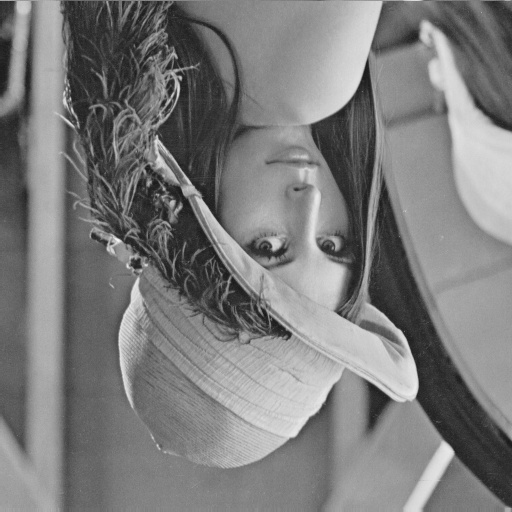
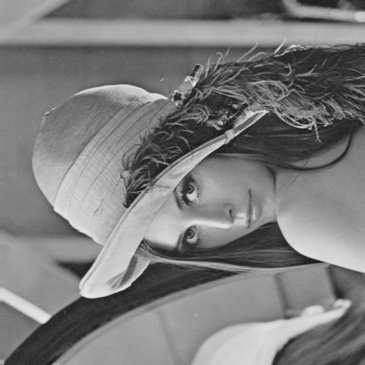
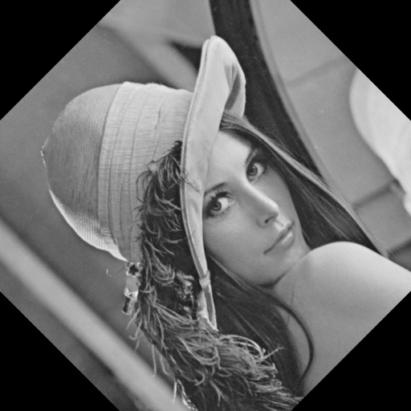
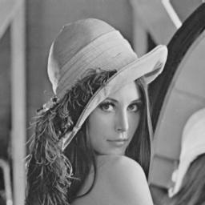

# Computer Vision Homework 1

## Basic Image Manipulation

**R11525079 游子霆**

### Description
In this homework, 6 basic image manipulations was implemented in python.


### Part 1.
**a. upside-down lena.bmp**

We swap the pixel values for `y` and `-y` to achieve the upside down result.
```python
    for ch_idx in range(ch):
        for x in range(w):
            for y in range(h // 2):
                img[y, x, ch_idx], img[-y, x, ch_idx] = img[-y, x, ch_idx], img[y, x, ch_idx]

```
By calling the function `flip_vertically(img)` written in `main.py` we can get the result.
```shell
python3 main.py --img=./inputs/lena.bmp --op=flip_v
```



**b. right-side left lena.bmp**
We swap the pixel values for `x` and `-x` to achieve the right-side left result.
```python
    for ch_idx in range(ch):
        for x in range(w // 2):
            for y in range(h):
                img[y, x, ch_idx], img[y, -x, ch_idx] = img[y, -x, ch_idx], img[y, x, ch_idx]
```
By calling the function `flip_horizontally(img)` written in `main.py` we can get the result.
```shell
python3 main.py --img=./inputs/lena.bmp --op=flip_h
```


**c. diagonally flip lena.bmp**
We swap the pixel values for `x` and `y` to achieve the diagonally flip result.
```python
    for ch_idx in range(ch):
        for x in range(w):
            for y in range(x, h):
                img[y, x, ch_idx], img[x, y, ch_idx] = img[x, y, ch_idx], img[y, x, ch_idx]
```
By calling the function `flip_diagonally(img)` written in `main.py` we can get the result.
```shell
python3 main.py --img=./inputs/lena.bmp --op=flip_d
```



### Part 2.
**d. rotate lena.bmp 45 degrees clockwise**
We use `cv2.getRotationMatrix2D` to get the rotation matrix for rotation, and then use `cv2.warpAffine` to apply the rotation matrix to the image.
```python
    center = tuple(np.array(img.shape[1::-1]) / 2)

    rot_mat = cv2.getRotationMatrix2D(center, angle, 1.0)

    result = cv2.warpAffine(img, rot_mat, img.shape[1::-1], flags=cv2.INTER_LINEAR)
```
By calling the function `rotate(img)` written in `main.py` we can get the result.
```shell
python3 main.py --img=./inputs/lena.bmp --op=rot
```



**e. shrink lena.bmp in half**
We use a 3 x 3 kernel to obtain average values to set to the shrunk image's pixels.
```python
    for ch_idx in range(ch):
        for x in range(w // 2):
            for y in range(h // 2):

                kernel_idx_x = raw_x = x * 2
                kernel_idx_y = raw_y = y * 2
                kernel_sum = 0
                available_count = 0
                for x_mv in idx_movement:
                    kernel_idx_x = raw_x + x_mv
                    if kernel_idx_x < 0 or kernel_idx_x >= w:
                        continue

                    for y_mv in idx_movement:
                        kernel_idx_y = raw_y + y_mv
                        if kernel_idx_y < 0 or kernel_idx_y >= h:
                            continue

                        available_count += 1
                        kernel_sum += img[kernel_idx_y, kernel_idx_x, ch_idx]

                # uses the average of neighbor pixels as result value
                result[y, x, ch_idx] = kernel_sum / available_count
```
By calling the function `shrink(img)` written in `main.py` we can get the result.
```shell
python3 main.py --img=./inputs/lena.bmp --op=shrink
```


**f. binarize lena.bmp at 128 to get a binary image**
Simply check every pixel value, if the value is over the threshold, which is 128 in this case, then we set the pixel value to be 255, otherwise set it to be 0.
```python
    for ch_idx in range(ch):
        for x in range(w):
            for y in range(h):
                value = img[y, x, ch_idx]

                if value >= thres:
                    img[y, x, ch_idx] = upper_val
                else:
                    img[y, x, ch_idx] = lower_val
```
By calling the function `binarize(img)` written in `main.py` we can get the result.
```shell
python3 main.py --img=./inputs/lena.bmp --op=bin
```

