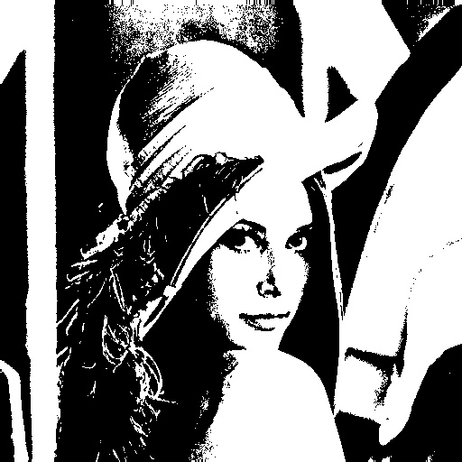

# Computer Vision Homework 2

## Basic Image Manipulation

**R11525079 游子霆**

### Description
In this homework, a program that can be used to generate
(a) a binary image (threshold at 128)
(b) a histogram
(c) connected components(regions with + at centroid, bounding box)
was implemented in python.


### Part 1.
**a. binary image (threshold at 128)**
Simply check every pixel value, if the value is over the threshold, which is 128 in this case, then we set the pixel value to be 255, otherwise set it to be 0.
```python
    for ch_idx in range(ch):
        for x in range(w):
            for y in range(h):
                value = img[y, x, ch_idx]

                if value >= thres:
                    img[y, x, ch_idx] = upper_val
                else:
                    img[y, x, ch_idx] = lower_val
```
By calling the function `binarize(img)` written in `main.py` we can get the result.
```shell
python3 main.py --img=./inputs/lena.bmp --op=bin
```


**b. histogram**
By going through each pixel and calculating the sum of each intensity value we can generate a histogram of the image.
```python
    hist = [0] * size

    for ch_idx in range(ch):
        for x in range(w):
            for y in range(h):
                value = img[y, x, ch_idx]

                hist[value] += 1
```
A histogram can be generated using the following command:
```shell
python3 hw_2/main.py --img=inputs/lena.bmp --op=hist
```


**c. connected components(regions with + at centroid, bounding box)**
Using BFS to check neighbors in 8 directions, and if connected, we store the indices to a dictionary with labels as keys. Then by counting the length of each value from the dictionary we can obtain the size of the component thus filter the components that are having areas smaller than our size threshold.
```python
    discovered_flag = -1
    label = -2
    label_increment = -1

    components = {}

    queue = []
    for x in range(w):
        for y in range(h):

            if img[y, x] == bin_val:
                queue.append((x, y))

            while queue:
                x, y = queue.pop()

                img[y, x] = label

                if label not in components:
                    components[label] = []

                components[label].append((x, y))

                # checks 8 neighbors
                mvs = (-1, 0, 1)
                for x_mv in mvs:
                    for y_mv in mvs:
                        next_x = x + x_mv
                        next_y = y + y_mv

                        # excludes out of bound indices
                        if next_x < 0 or next_y < 0 or next_x >= w or next_y >= h:
                            continue

                        # excludes checked pixels
                        if img[next_y, next_x] != bin_val:
                            continue

                        img[next_y, next_x] = discovered_flag
                        queue.append((next_x, next_y))

            if label in components:
                label += label_increment

    components = {k: v for k, v in components.items() if len(v) >= size_thres}

```
The components can be drawn on a binarized image using the following command:
```shell
python3 hw_2/main.py --img=inputs/lena.bmp --op=comp
```

