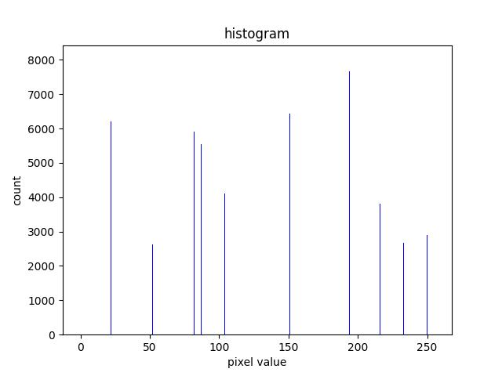

# Computer Vision Homework 3

## Histogram Equalization

**R11525079 游子霆**

### Description
In this homework, a program that can be used to generate
(a) original image and its histogram
(b) image with intensity divided by 3 and its histogram
(c) image after applying histogram equalization to (b) and its histogram
was implemented in python.


### Part 1.
**a. histogram**
By going through each pixel and calculating the sum of each intensity value we can generate a histogram of the image.
```python
    hist = [0] * size

    for ch_idx in range(ch):
        for x in range(w):
            for y in range(h):
                value = img[y, x, ch_idx]

                hist[value] += 1
```
A histogram and the original image can be generated using the following command:
```shell
python3 hw_3/main.py --img=inputs/lena.bmp --op=hist
```


**b. image with intensity divided by 3 and its histogram**
By going through each pixel and divide the intensity of it we obtain the result.
```python
    for ch_idx in range(ch):
        for x in range(w):
            for y in range(h):
                img[y, x, ch_idx] = img[y, x, ch_idx] // divider
```
The result image and its histogram can be generated using the following command:
```shell
python3 hw_3/main.py --img=inputs/lena.bmp --op=divide
```


**c. image after applying histogram equalization to (b) and its histogram**
By calculating the accumulation rate and multiplying it to the max intensity, which is 255 in this case, we can map the original value to the equalized one.
```python
    pixel_sum = sum(hist)

    accumulation = 0
    eq_map = {}

    for i in range(len(hist)):
        accumulation += hist[i] / pixel_sum
        eq_map[i] = accumulation * max_intensity

    for ch_idx in range(ch):
        for x in range(w):
            for y in range(h):
                img[y, x, ch_idx] = eq_map[img[y, x, ch_idx]]
```
The result image and its histogram can be generated using the following command:
```shell
python3 hw_2/main.py --img=inputs/lena.bmp --op=hist_eq
```


