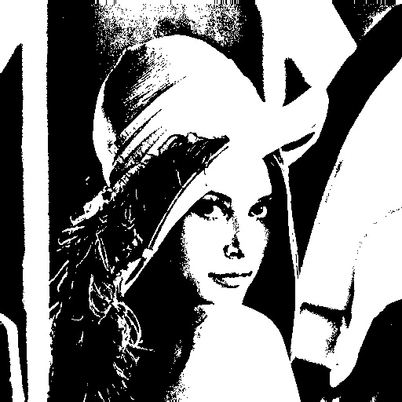
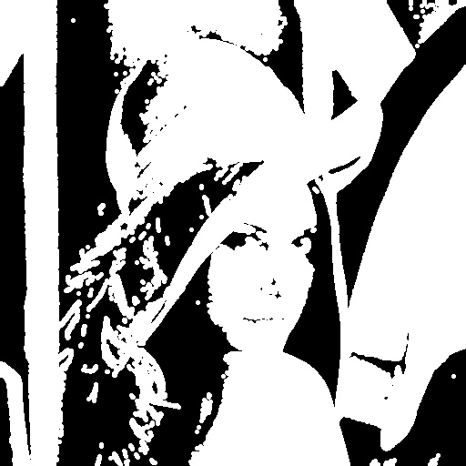
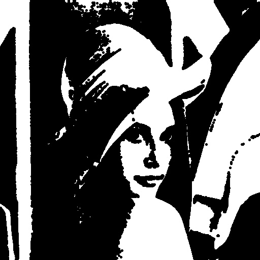
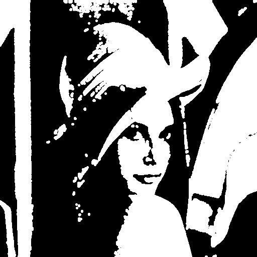
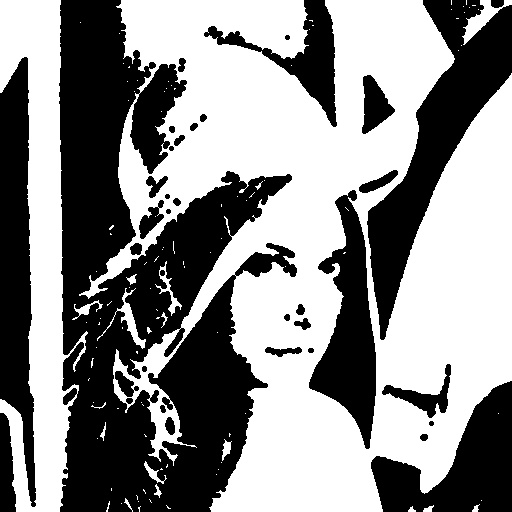
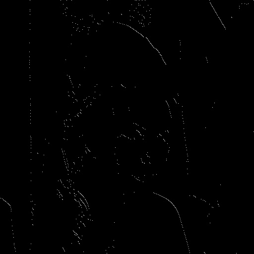

# Computer Vision Homework 4

## Mathematical Morphology - Binary Morphology

**R11525079 游子霆**

### Description
In this homework, a program that can be used to perform
(a) Dilation
(b) Erosion
(c) Opening
(d) Closing
(e) Hit-and-miss transform


### Part 1.

First we binarize the original image.


**a. Dilation**
By going through each pixel and check if the adjacent pixels match the structure in the kernel we can generate the result
```python
    for ch_idx in range(ch):
        for x in range(w):
            for y in range(h):

                if img[y, x, ch_idx] == binary_val:

                    for kernel_x in range(kernel_w):
                        for kernel_y in range(kernel_h):
                            if kernel[kernel_y, kernel_x] == 0:
                                continue

                            offset_x = kernel_x - kernel_w // 2
                            offset_y = kernel_y - kernel_h // 2

                            if y + offset_y >= h or y + offset_y < 0:
                                continue

                            if x + offset_x >= w or x + offset_x < 0:
                                continue

                            result[y + offset_y, x + offset_x] = binary_val
```
A dilated image and the binarized image can be generated using the following command:
```shell
python3 hw_4/main.py --img=inputs/lena.bmp --op=dilation
```


**b. Erosion**
By going through each pixel and check if the adjacent pixels match the structure in the kernel we can generate the result
```python
    for ch_idx in range(ch):
        for x in range(w):
            for y in range(h):

                result[y, x, ch_idx] = binary_val

                for kernel_x in range(kernel_w):
                    for kernel_y in range(kernel_h):

                        offset_x = kernel_x - kernel_w // 2
                        offset_y = kernel_y - kernel_h // 2

                        if kernel[kernel_y, kernel_x] == 0:
                            continue

                        if y + offset_y >= h or y + offset_y < 0:
                            continue

                        if x + offset_x >= w or x + offset_x < 0:
                            continue

                        # checks for foreground structure
                        if kernel[kernel_y, kernel_x] == 1 and img[y + offset_y, x + offset_x, ch_idx] == 0:
                            result[y, x, ch_idx] = 0
                            break

                        # checks for background structure
                        if kernel[kernel_y, kernel_x] == -1 and img[y + offset_y, x + offset_x, ch_idx] == binary_val:
                            result[y, x, ch_idx] = 0
                            break

                    if result[y, x, ch_idx] == 0:
                        break
```
A eroded image and the binarized image can be generated using the following command:
```shell
python3 hw_4/main.py --img=inputs/lena.bmp --op=erosion
```


**c. Opening**
By performing erosion and then dilation we can generate the result
```python
        result = erosion(img, kernel=kernel)
        result = dilation(result, kernel=kernel)
```
The image after opening operation is performed can be generated using the following command:
```shell
python3 hw_4/main.py --img=inputs/lena.bmp --op=opening
```


**d. Closing**
By performing dilation and then erosion we can generate the result
```python
        result = dilation(result, kernel=kernel)
        result = erosion(img, kernel=kernel)
```
The image after closing operation is performed can be generated using the following command:
```shell
python3 hw_4/main.py --img=inputs/lena.bmp --op=closing
```


**e. Hit-and-miss transform**
By performing erosion on the binary image with kernel_j, and performing erosion on the inverted binary image with kernel_k and intersect them we can get the final result
```python
        result_j = erosion(img, kernel=kernel_j)
        inverted = invert(img)
        result_k = erosion(inverted, kernel=kernel_k)
        result = intersect(result_j, result_k)
```
The image after hit-and-miss operation is performed can be generated using the following command:
```shell
python3 hw_4/main.py --img=inputs/lena.bmp --op=hit_n_miss
```

