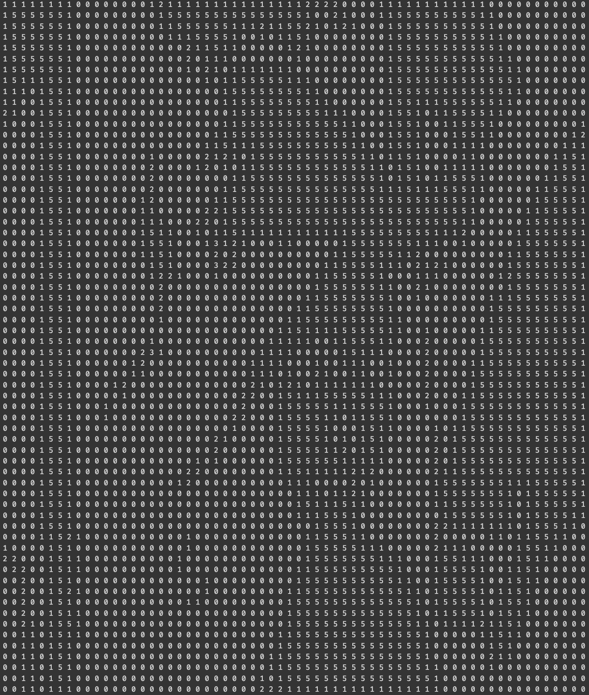

# Computer Vision Homework 6

## Yokoi Connectivity Number

**R11525079 游子霆**

### Description
In this homework, a program that can be used to count the Yokoi connectivity number on a downsampled image

**Yokoi**
By going through each pixel and use the maximum value in the pixel set of kernel as the new value
```python
    for ch_idx in range(ch):
        for x in range(w):
            for y in range(h):
                if img[y, x, ch_idx] > 0:
                    if y == 0:
                        if x == 0:
                            x7, x2, x6 = 0, 0, 0
                            x3, x0, x1 = 0, img[y, x, ch_idx], img[y, x + 1, ch_idx]
                            x8, x4, x5 = 0, img[y + 1, x, ch_idx], img[y + 1, x + 1, ch_idx]

                        elif x == w - 1:
                            x7, x2, x6 = 0, 0, 0
                            x3, x0, x1 = img[y, x - 1, ch_idx], img[y, x, ch_idx], 0
                            x8, x4, x5 = img[y + 1, x - 1, ch_idx], img[y + 1, x, ch_idx], 0

                        else:
                            x7, x2, x6 = 0, 0, 0
                            x3, x0, x1 = img[y, x - 1, ch_idx], img[y, x, ch_idx], img[y, x + 1, ch_idx]
                            x8, x4, x5 = img[y + 1, x - 1, ch_idx], img[y + 1, x, ch_idx], img[y + 1, x + 1, ch_idx]

                    elif y == h - 1:
                        if x == 0:
                            x7, x2, x6 = 0, img[y - 1, x, ch_idx], img[y - 1, x + 1, ch_idx]
                            x3, x0, x1 = 0, img[y, x, ch_idx], img[y, x + 1, ch_idx]
                            x8, x4, x5 = 0, 0, 0

                        elif x == w - 1:
                            x7, x2, x6 = img[y - 1, x - 1, ch_idx], img[y - 1, x, ch_idx], 0
                            x3, x0, x1 = img[y, x - 1, ch_idx], img[y, x, ch_idx], 0
                            x8, x4, x5 = 0, 0, 0

                        else:
                            x7, x2, x6 = img[y - 1, x - 1, ch_idx], img[y - 1, x, ch_idx], img[y - 1, x + 1, ch_idx]
                            x3, x0, x1 = img[y, x - 1, ch_idx], img[y, x, ch_idx], img[y, x + 1, ch_idx]
                            x8, x4, x5 = 0, 0, 0
                    else:
                        if x == 0:
                            x7, x2, x6 = 0, img[y - 1, x, ch_idx], img[y - 1, x + 1, ch_idx]
                            x3, x0, x1 = 0, img[y, x, ch_idx], img[y, x + 1, ch_idx]
                            x8, x4, x5 = 0, img[y + 1, x, ch_idx], img[y + 1, x + 1, ch_idx]

                        elif x == w - 1:
                            x7, x2, x6 = img[y - 1, x - 1, ch_idx], img[y - 1, x, ch_idx], 0
                            x3, x0, x1 = img[y, x - 1, ch_idx], img[y, x, ch_idx], 0
                            x8, x4, x5 = img[y + 1, x - 1, ch_idx], img[y + 1, x, ch_idx], 0

                        else:
                            x7, x2, x6 = img[y - 1, x - 1, ch_idx], img[y - 1, x, ch_idx], img[y - 1, x + 1, ch_idx]
                            x3, x0, x1 = img[y, x - 1, ch_idx], img[y, x, ch_idx], img[y, x + 1, ch_idx]
                            x8, x4, x5 = img[y + 1, x - 1, ch_idx], img[y + 1, x, ch_idx], img[y + 1, x + 1, ch_idx]

                    a1 = h_op(x0, x1, x6, x2)
                    a2 = h_op(x0, x2, x7, x3)
                    a3 = h_op(x0, x3, x8, x4)
                    a4 = h_op(x0, x4, x5, x1)

                    if a1 == 'r' and a2 == 'r' and a3 == 'r' and a4 == 'r':
                        result[y, x, ch_idx] = 5

                    else:
                        num = 0
                        for a_i in [a1, a2, a3, a4]:
                            if a_i == 'q':
                                num += 1

                        result[y, x, ch_idx] = num

    return result
```
Yokoi connectivity number matrix can be generated using the following command
```shell
python3 hw_6/main.py --img=inputs/lena.bmp --op=yokoi
```

