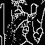

# Computer Vision Homework 7

## Thinning

**R11525079 游子霆**

### Description
In this homework, a program that can be used to thinning operation on a downsampled image

**Thinning**
By iteratively perform pair relation operator and shrink operation until nothing changes we can obtain the result.
```python
def pair_relation(yokoi_img: np.ndarray, img: np.ndarray) -> np.ndarray:
    h, w = img.shape[:2]
    ch = 1
    if len(img.shape) > 2:
        ch = img.shape[2]
    elif len(img.shape) == 2:
        img = np.expand_dims(img, axis=-1)

    marked_img = np.zeros_like(img)

    def h_op(x_0: int, x_1: int, x_2: int, x_3: int, x_4: int, m: int = 1) -> int:
        if x_0 == m and (x_1 == m or x_2 == m or x_3 == m or x_4 == m):
            return 1
        return 2

    for ch_idx in range(ch):
        for x in range(w):
            for y in range(h):
                x_0 = yokoi_img[y, x, ch_idx]

                x_1 = 0
                if x - 1 >= 0:
                    x_1 = yokoi_img[y, x - 1, ch_idx]

                x_2 = 0
                if x + 1 < w:
                    x_2 = yokoi_img[y, x + 1, ch_idx]

                x_3 = 0
                if y - 1 >= 0:
                    x_3 = yokoi_img[y - 1, x, ch_idx]

                x_4 = 0
                if y + 1 < h:
                    x_4 = yokoi_img[y + 1, x, ch_idx]

                marked_img[y, x, ch_idx] = h_op(x_0, x_1, x_2, x_3, x_4)

    return marked_img


def thinning(bin_img, img_pair):

    h, w = bin_img.shape[:2]

    def shrink_op(b: int, c: int, d: int, e: int) -> int:
        if b == c and (d != b or e != b):
            return 1

        return 0

    def kernel_op(bin_img: np.ndarray, x: int, y: int):
        if y == 0:
            if x == 0:
                x7, x2, x6 = 0, 0, 0
                x3, x0, x1 = 0, bin_img[y, x], bin_img[y, x + 1]
                x8, x4, x5 = 0, bin_img[y + 1, x], bin_img[y + 1, x + 1]

            elif x == w - 1:
                x7, x2, x6 = 0, 0, 0
                x3, x0, x1 = bin_img[y, x - 1], bin_img[y, x], 0
                x8, x4, x5 = bin_img[y + 1, x - 1], bin_img[y + 1, x], 0

            else:
                x7, x2, x6 = 0, 0, 0
                x3, x0, x1 = bin_img[y, x - 1], bin_img[y, x], bin_img[y, x + 1]
                x8, x4, x5 = bin_img[y + 1, x - 1], bin_img[y + 1, x], bin_img[y + 1, x + 1]

        elif y == h - 1:
            if x == 0:
                x7, x2, x6 = 0, bin_img[y - 1, x], bin_img[y - 1, x + 1]
                x3, x0, x1 = 0, bin_img[y, x], bin_img[y, x + 1]
                x8, x4, x5 = 0, 0, 0

            elif x == w - 1:
                x7, x2, x6 = bin_img[y - 1, x - 1], bin_img[y - 1, x], 0
                x3, x0, x1 = bin_img[y, x - 1], bin_img[y, x], 0
                x8, x4, x5 = 0, 0, 0

            else:
                x7, x2, x6 = bin_img[y - 1, x - 1], bin_img[y - 1, x], bin_img[y - 1, x + 1]
                x3, x0, x1 = bin_img[y, x - 1], bin_img[y, x], bin_img[y, x + 1]
                x8, x4, x5 = 0, 0, 0

        else:
            if x == 0:
                x7, x2, x6 = 0, bin_img[y - 1, x], bin_img[y - 1, x + 1]
                x3, x0, x1 = 0, bin_img[y, x], bin_img[y, x + 1]
                x8, x4, x5 = 0, bin_img[y + 1, x], bin_img[y + 1, x + 1]

            elif x == w - 1:
                x7, x2, x6 = bin_img[y - 1, x - 1], bin_img[y - 1, x], 0
                x3, x0, x1 = bin_img[y, x - 1], bin_img[y, x], 0
                x8, x4, x5 = bin_img[y + 1, x - 1], bin_img[y + 1, x], 0

            else:
                x7, x2, x6 = bin_img[y - 1, x - 1], bin_img[y - 1, x], bin_img[y - 1, x + 1]
                x3, x0, x1 = bin_img[y, x - 1], bin_img[y, x], bin_img[y, x + 1]
                x8, x4, x5 = bin_img[y + 1, x - 1], bin_img[y + 1, x], bin_img[y + 1, x + 1]

        a1 = shrink_op(x0, x1, x6, x2)
        a2 = shrink_op(x0, x2, x7, x3)
        a3 = shrink_op(x0, x3, x8, x4)
        a4 = shrink_op(x0, x4, x5, x1)

        if a1 + a2 + a3 + a4 == 1:
            return 0

        return x0

    # iteratively perform thinning
    bin_img = bin_img.copy()
    for y in range(h):
        for x in range(w):
            if bin_img[y, x] > 0 and img_pair[y, x] != 2:
                bin_img[y, x] = kernel_op(bin_img, x, y)
    return bin_img

        img = downsample(img, scale=8)
        bin_img = binarize(img)

        thinned = bin_img
        while True:
            yokoi_mat = yokoi(thinned)
            marked = pair_relation(yokoi_mat, thinned)

            new_thinned = thinning(thinned, marked)

            if (thinned != new_thinned).sum() == 0:
                break

            thinned = new_thinned

        cv2.imwrite("thinning.jpg", thinned)
```
The image after thinning is performed can be generated using the following command
```shell
python3 hw_7/main.py --img=inputs/lena.bmp --op=thinning
```

