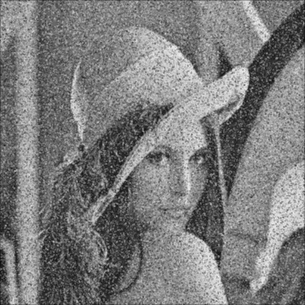
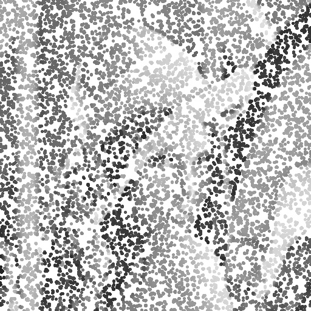
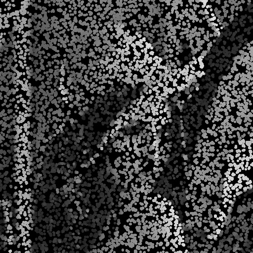
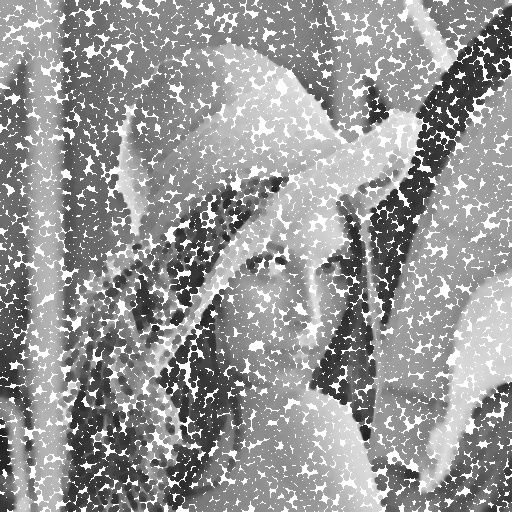
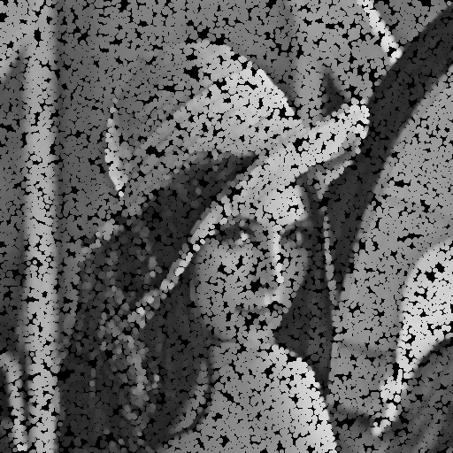
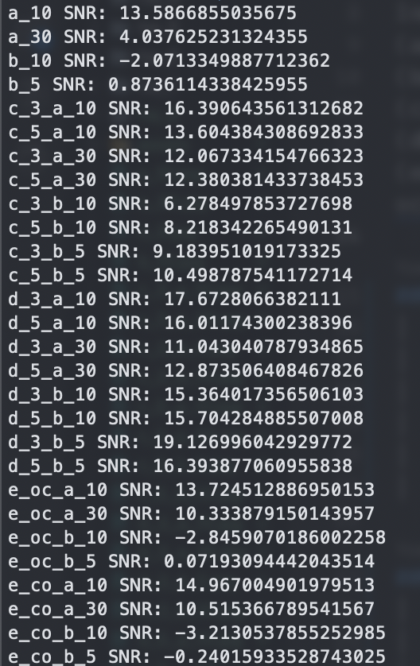

# Computer Vision Homework 8

## Noise Removal

**R11525079 游子霆**

### Description
In this homework, a program that can be used to
(a) Generate noisy images with gaussian noise(amplitude of 10 and 30)
(b) Generate noisy images with salt-and-pepper noise( probability 0.1 and 0.05)
(c) Use the 3x3, 5x5 box filter on images generated by (a)(b)
(d) Use 3x3, 5x5 median filter on images generated by (a)(b)
(e) Use both opening-then-closing and closing-then opening filter (using the octogonal 3-5-5-5-3 kernel, value = 0) on images generated by (a)(b)

### gaussian noise amplitude = 10
|                                   |                                   |
| --------------------------------- | --------------------------------- |
|       |                                   |
|   |   |
|   |   |
|  |  |

### gaussian noise amplitude = 30
|                                   |                                   |
| --------------------------------- | --------------------------------- |
|       |                                   |
|   |   |
|   |   |
|  |  |

### salt-and-pepper noise probability = 0.1
|                                   |                                   |
| --------------------------------- | --------------------------------- |
|       |                                   |
|   |   |
|   |   |
|  |  |

### salt-and-pepper noise probability = 0.05
|                                  |                                  |
| -------------------------------- | -------------------------------- |
|       |                                  |
|   |   |
|   |   |
|  |  |

#### SNR

