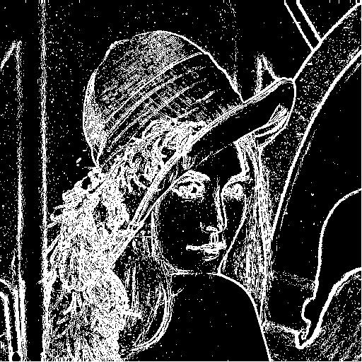
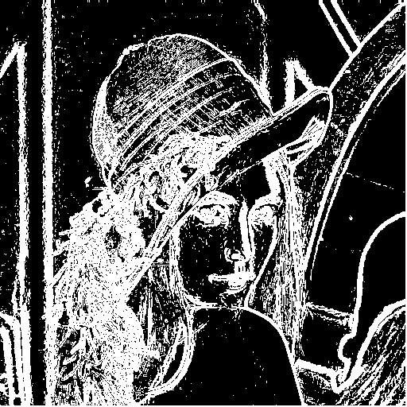
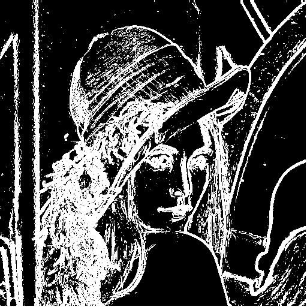
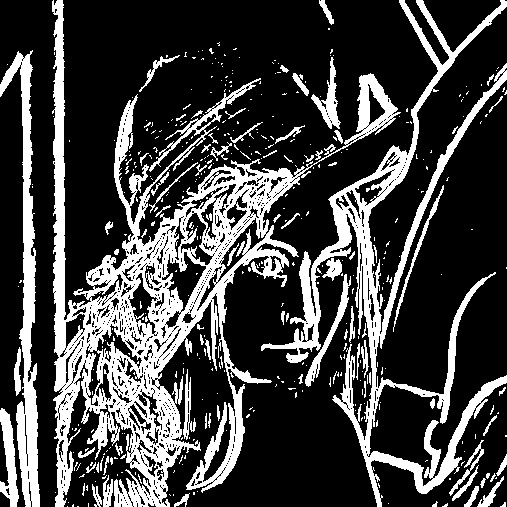

# Computer Vision Homework 9

## General Edge Detection

**R11525079 游子霆**

### Description
In this homework, a program that can be used to detect edge with following threshold is implemented
(a) Robert's Operator: 12
(b) Prewitt's Edge Detector: 24
(c) Sobel's Edge Detector: 38
(d) Frei and Chen's Gradient Operator: 30
(e) Kirsch's Compass Operator: 135
(f) Robinson's Compass Operator: 43
(g) Nevatia-Babu 5x5 Operator: 12500

|                                    |                                     |
| ---------------------------------- | ----------------------------------- |
| (a)  | (b)  |
| (c)   | (d)     |
| (e)  | (f) |
| (g) |                                     |


### Implementation
First perform edge detection then binarize the outputs with given thresholds.
```python
    if op == "robert":
        img = robert(img)
        img = binarize(img, thres=12)

        cv2.imwrite("{}.jpg".format(op), img)

    elif op == "prewitt":
        img = prewitt(img)
        img = binarize(img, thres=24)

        cv2.imwrite("{}.jpg".format(op), img)

    elif op == "sobel":
        img = sobel(img)
        img = binarize(img, thres=38)

        cv2.imwrite("{}.jpg".format(op), img)

    elif op == "frei":
        img = frei_and_chen(img)
        img = binarize(img, thres=30)

        cv2.imwrite("{}.jpg".format(op), img)

    elif op == "kirsch":
        img = kirsch_compass(img)
        img = binarize(img, thres=135)

        cv2.imwrite("{}.jpg".format(op), img)

    elif op == "robinson":
        img = robinson_compass(img)
        img = binarize(img, thres=43)

        cv2.imwrite("{}.jpg".format(op), img)

    elif op == "nevatia":
        img = neviatia_babu(img)
        img = binarize(img, thres=12500)

        cv2.imwrite("{}.jpg".format(op), img)
```


Details of each edge detector:
```python

def binarize(img: np.ndarray, thres: int = 128, upper_val: int = 255, lower_val: int = 0) -> np.ndarray:

    h, w = img.shape[:2]

    for x in range(w):
        for y in range(h):
            value = img[y, x]

            if value >= thres:
                img[y, x] = upper_val
            else:
                img[y, x] = lower_val

    return img


def conv(img: np.ndarray, kernel: np.ndarray) -> float:

    img_h, img_w = img.shape[:2]
    k_h, k_w = kernel.shape[:2]

    res = 0
    for i in range(img_h):
        for j in range(img_w):
            if img_h - i - 1 >= 0 and img_h - i - 1 < k_h and img_w - j - 1 >= 0 and img_w - j - 1 < k_w:
                res += img[i, j] * kernel[img_h - i - 1, img_w - j - 1]

    return res


def robert(img: np.ndarray):
    k1 = np.array([
        [1, 0],
        [0, -1]
    ])

    k2 = np.array([
        [0, 1],
        [-1, 0]
    ])

    gx = np.zeros(img.shape, dtype='int32')
    gy = np.zeros(img.shape, dtype='int32')

    h, w = img.shape
    for i in range(h):
        for j in range(w):
            gx[i, j] = conv(img[i:i + 2, j:j + 2], k1)
            gy[i, j] = conv(img[i:i + 2, j:j + 2], k2)

    return np.sqrt(gx ** 2 + gy ** 2)


def prewitt(img: np.ndarray):
    k1 = np.array([
        [-1, 0, 1],
        [-1, 0, 1],
        [-1, 0, 1]
    ])

    k2 = np.array([
        [-1, -1, -1],
        [0, 0, 0],
        [1, 1, 1]
    ])

    gx = np.zeros(img.shape, dtype='int32')
    gy = np.zeros(img.shape, dtype='int32')

    h, w = img.shape
    for i in range(h):
        for j in range(w):
            gx[i, j] = conv(img[i:i + 3, j:j + 3], k1)
            gy[i, j] = conv(img[i:i + 3, j:j + 3], k2)

    return np.sqrt(gx ** 2 + gy ** 2)


def sobel(img: np.ndarray):
    k1 = np.array([
        [-1, 0, 1],
        [-2, 0, 2],
        [-1, 0, 1]
    ])
    k2 = np.array([
        [-1, -2, -1],
        [0, 0, 0],
        [1, 2, 1]
    ])

    gx = np.zeros(img.shape, dtype='int32')
    gy = np.zeros(img.shape, dtype='int32')

    h, w = img.shape
    for i in range(h):
        for j in range(w):
            gx[i, j] = conv(img[i:i + 3, j:j + 3], k1)
            gy[i, j] = conv(img[i:i + 3, j:j + 3], k2)

    return np.sqrt(gx ** 2 + gy ** 2)


def frei_and_chen(img: np.ndarray):
    k1 = np.array([
        [-1, -np.sqrt(2), -1],
        [0, 0, 0],
        [1, np.sqrt(2), 1]
    ])
    k2 = np.array([
        [-1, 0, 1],
        [-np.sqrt(2), 0, np.sqrt(2)],
        [-1, 0, 1]
    ])

    gx = np.zeros(img.shape, dtype='int32')
    gy = np.zeros(img.shape, dtype='int32')

    h, w = img.shape
    for i in range(h):
        for j in range(w):
            gx[i, j] = conv(img[i:i + 3, j:j + 3], k1)
            gy[i, j] = conv(img[i:i + 3, j:j + 3], k2)

    return np.sqrt(gx ** 2 + gy ** 2)


def kirsch_compass(img: np.ndarray):
    k0 = np.array([
        [-3, -3, 5],
        [-3, 0, 5],
        [-3, -3, 5]
    ])
    k1 = np.array([
        [-3, 5, 5],
        [-3, 0, 5],
        [-3, -3, -3]
    ])
    k2 = np.array([
        [5, 5, 5],
        [-3, 0, -3],
        [-3, -3, -3]
    ])
    k3 = np.array([
        [5, 5, -3],
        [5, 0, -3],
        [-3, -3, -3]
    ])
    k4 = np.array([
        [5, -3, -3],
        [5, 0, -3],
        [5, -3, -3]
    ])
    k5 = np.array([
        [-3, -3, -3],
        [5, 0, -3],
        [5, 5, -3]
    ])
    k6 = np.array([
        [-3, -3, -3],
        [-3, 0, -3],
        [5, 5, 5]
    ])
    k7 = np.array([
        [-3, -3, -3],
        [-3, 0, 5],
        [-3, 5, 5]
    ])

    g = np.zeros(img.shape, dtype='int32')

    h, w = img.shape
    for i in range(h):
        for j in range(w):
            r0 = conv(img[i:i + 3, j:j + 3], k0)
            r1 = conv(img[i:i + 3, j:j + 3], k1)
            r2 = conv(img[i:i + 3, j:j + 3], k2)
            r3 = conv(img[i:i + 3, j:j + 3], k3)
            r4 = conv(img[i:i + 3, j:j + 3], k4)
            r5 = conv(img[i:i + 3, j:j + 3], k5)
            r6 = conv(img[i:i + 3, j:j + 3], k6)
            r7 = conv(img[i:i + 3, j:j + 3], k7)
            r0 = conv(img[i:i + 3, j:j + 3], k0)
            g[i, j] = np.max([r0, r1, r2, r3, r4, r5, r6, r7])

    return g


def robinson_compass(img: np.ndarray):
    k0 = np.array([
        [-1, 0, 1],
        [-2, 0, 2],
        [-1, 0, 1]
    ])
    k1 = np.array([
        [0, 1, 2],
        [-1, 0, 1],
        [-2, -1, 0]
    ])
    k2 = np.array([
        [1, 2, 1],
        [0, 0, 0],
        [-1, -2, -1]
    ])
    k3 = np.array([
        [2, 1, 0],
        [1, 0, -1],
        [0, -1, -2]
    ])
    k4 = np.array([
        [1, 0, -1],
        [2, 0, -2],
        [1, 0, -1]
    ])
    k5 = np.array([
        [0, -1, -2],
        [1, 0, -1],
        [2, 1, 0]
    ])
    k6 = np.array([
        [-1, -2, -1],
        [0, 0, 0],
        [1, 2, 1]
    ])
    k7 = np.array([
        [-2, -1, 0],
        [-1, 0, 1],
        [0, 1, 2]
    ])

    g = np.zeros(img.shape, dtype='int32')

    h, w = img.shape
    for i in range(h):
        for j in range(w):
            r0 = conv(img[i:i + 3, j:j + 3], k0)
            r1 = conv(img[i:i + 3, j:j + 3], k1)
            r2 = conv(img[i:i + 3, j:j + 3], k2)
            r3 = conv(img[i:i + 3, j:j + 3], k3)
            r4 = conv(img[i:i + 3, j:j + 3], k4)
            r5 = conv(img[i:i + 3, j:j + 3], k5)
            r6 = conv(img[i:i + 3, j:j + 3], k6)
            r7 = conv(img[i:i + 3, j:j + 3], k7)
            g[i, j] = np.max([r0, r1, r2, r3, r4, r5, r6, r7])

    return g


def neviatia_babu(img: np.ndarray):
    k0 = np.array([
        [100, 100, 100, 100, 100],
        [100, 100, 100, 100, 100],
        [0, 0, 0, 0, 0],
        [-100, -100, -100, -100, -100],
        [-100, -100, -100, -100, -100],
    ])
    k1 = np.array([
        [100, 100, 100, 100, 100],
        [100, 100, 100, 78, -32],
        [100, 92, 0, -92, -100],
        [32, -78, -100, -100, -100],
        [-100, -100, -100, -100, -100]
    ])
    k2 = np.array([
        [100, 100, 100, 32, -100],
        [100, 100, 92, -78, -100],
        [100, 100, 0, -100, -100],
        [100, 78, -92, -100, -100],
        [100, -32, -100, -100, -100]
    ])
    k3 = np.array([
        [-100, -100, 0, 100, 100],
        [-100, -100, 0, 100, 100],
        [-100, -100, 0, 100, 100],
        [-100, -100, 0, 100, 100],
        [-100, -100, 0, 100, 100]
    ])
    k4 = np.array([
        [-100, 32, 100, 100, 100],
        [-100, -78, 92, 100, 100],
        [-100, -100, 0, 100, 100],
        [-100, -100, -92, 78, 100],
        [-100, -100, -100, -32, 100]
    ])
    k5 = np.array([
        [100, 100, 100, 100, 100],
        [-32, 78, 100, 100, 100],
        [-100, -92, 0, 92, 100],
        [-100, -100, -100, -78, 32],
        [-100, -100, -100, -100, -100]
    ])

    g = np.zeros((img.shape[0] - 5, img.shape[0] - 5), dtype='int32')

    h, w = g.shape
    for i in range(h):
        for j in range(w):
            r0 = np.sum(img[i:i + 5, j:j + 5] * k0)
            r1 = np.sum(img[i:i + 5, j:j + 5] * k1)
            r2 = np.sum(img[i:i + 5, j:j + 5] * k2)
            r3 = np.sum(img[i:i + 5, j:j + 5] * k3)
            r4 = np.sum(img[i:i + 5, j:j + 5] * k4)
            r5 = np.sum(img[i:i + 5, j:j + 5] * k5)
            g[i, j] = np.max([r0, r1, r2, r3, r4, r5])

    return g
```
